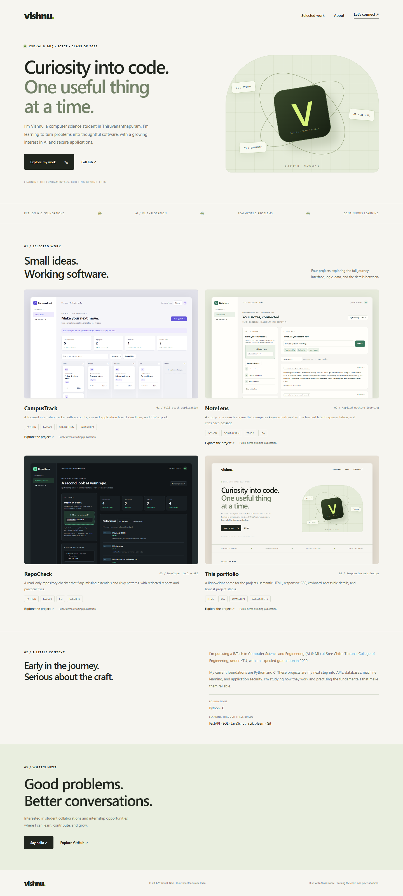

# Vishnu R. Nair - Portfolio

A responsive personal website presenting four real builds and an honest learning profile.

**[Open the live portfolio ↗](https://vishnu-portfolio-1ijm.onrender.com)** · [Download resume](https://vishnu-portfolio-1ijm.onrender.com/assets/Vishnu_R_Nair_Resume.pdf)

[Resume (PDF)](assets/Vishnu_R_Nair_Resume.pdf) · [Quick start](#run-locally) · [Engineering decisions](#engineering-decisions) · [Code walkthrough](docs/EXPLAINED.md) · [Mobile preview](docs/screenshot-mobile.png)

## Features

- Original responsive layout with a CSS illustration and self-hosted application screenshots.
- Interactive project details with keyboard-accessible native dialogs.
- Education, current foundations, learning focus and verified contact links.
- Reduced-motion support, semantic landmarks and visible keyboard focus.
- Publication status is explicit; no made-up live links or experience claims.

## Engineering decisions

A small frontend with deliberate accessibility choices.

| Decision | Reason |
| --- | --- |
| Semantic HTML | Landmarks and native controls provide a clear document structure. |
| Native project dialogs | Project details support keyboard interaction and Escape to close. |
| Self-hosted assets | Screenshots and styling are served with the site, without external fonts or analytics. |
| Verified links only | Live-demo links are enabled only when their deployments have been checked. |

## Tech stack

Semantic HTML, CSS, vanilla JavaScript

## Run locally

From this folder, run `python -m http.server 8000 --bind 127.0.0.1`, then open **http://127.0.0.1:8000**.
No npm install or build step is required. Static hosting can serve the folder directly.

## Deploy

The portfolio is deployed as a Render static site with HTTPS and CDN delivery. Its build copies only `index.html`, `style.css`, `app.js`, `favicon.svg` and `assets/` into `public/`; documentation and test tooling are not published. See [deployment status, verification and recovery](docs/DEPLOYMENT.md).

This service was created from its public Git URL. Render requires a connected Git provider for automatic deploys; until that connection is enabled, use **Manual Deploy → Deploy latest commit** after reviewing a change. The optional GitHub Pages workflow remains available for a separately configured Pages site.

The current GitHub links point to the verified existing account, `me-vishnurnair`. The preferred handle `vishnurnair-dev` is not assumed available or active. After a confirmed account rename, update these links and the contact details if needed.

## Update project links

`app.js` contains the project data and `published` mapping. Enter an actual verified demo URL only after successful deployment. Until then the UI clearly says publication is pending. The four screenshots are real local browser captures, not rendered mockups.

## Verification

Live HTTP checks passed on 1 October 2026 for the portfolio, NoteLens and RepoCheck. The [verification workflow](https://github.com/me-vishnurnair/portfolio/actions/runs/36832848807) exercises asset delivery, the resume download, note-search sessions and scanner input boundaries. CampusTrack now has a free static browser edition with local persistence and backup/restore, plus its original account edition on a trial database. See [current hosting and recovery](docs/DEPLOYMENT.md).

The project detail dialog was opened and closed by keyboard in a browser. All four project images were generated from the applications. A 390 px mobile layout was checked for horizontal page overflow. No automated unit test mirrors static markup; functional checks target user behavior instead.

## Understand the code

Read [docs/EXPLAINED.md](docs/EXPLAINED.md) for the request flow, technology choices, limitations and ten interview questions with answers.

## Attribution and license

Original application code created for Vishnu R. Nair with AI assistance. Third-party libraries retain their licenses. The project is an AI-assisted learning build; the owner is working through the implementation. MIT license; see [LICENSE](LICENSE).
